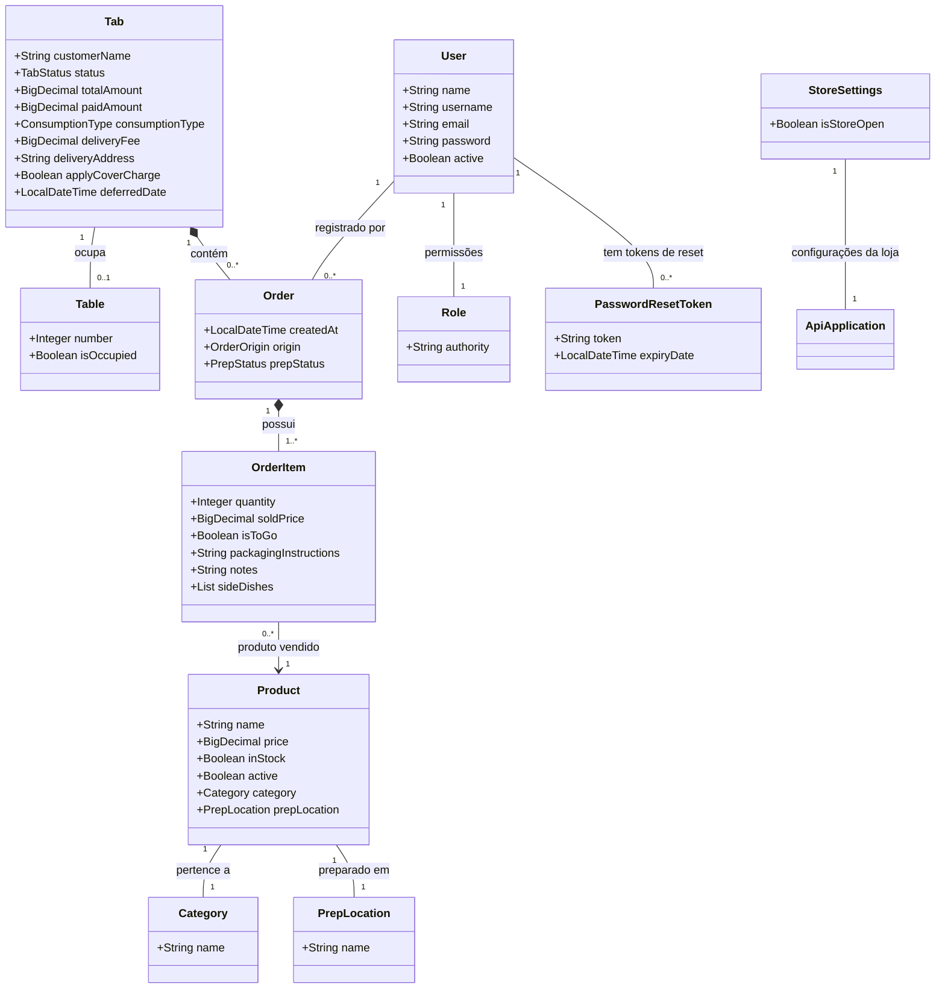

# Syskewer API - Gestão Inteligente para Bares e Restaurantes

Bem-vindo ao repositório backend do **Syskewer**. Este projeto representa o núcleo de um sistema de gestão para estabelecimentos gastronômicos, como bares e restaurantes. Ele foi concebido para orquestrar operações complexas de forma eficiente, segura e escalável, automatizando processos desde a entrada do cliente até o fechamento do caixa.

Desenvolvido com foco em **Java 21** e **Spring Boot 3**, o Syskewer utiliza **PostgreSQL** como banco de dados e implementa autenticação e autorização baseadas em **JWT (JSON Web Tokens)**. A gestão de dependências é feita via **Maven**, e o projeto é conteinerizável com **Docker** e **Docker Compose**.

## 🎯 Regras de Negócio e Funcionalidades Detalhadas

O Syskewer vai além de um sistema CRUD básico, abordando a complexidade real de um ambiente de restaurante através de regras de negócio rigorosas e funcionalidades específicas:

### 1. Gestão de Comandas e Mesas

*   **Abertura de Comandas:** Permite a abertura de comandas para mesas ou balcão. Para mesas, o sistema verifica a disponibilidade e marca a mesa como ocupada. Para balcão, um nome padrão é atribuído se não for fornecido.
*   **Fechamento de Comandas:** Uma comanda só pode ser fechada se o saldo devedor for zero. Caso contrário, o sistema exige o registro de pagamento.
*   **Liberação de Mesas:** A mesa é liberada automaticamente apenas quando todas as comandas associadas a ela são fechadas ou arquivadas como fiado.
*   **Couvert Artístico:** Possibilidade de aplicar couvert artístico. Se a comanda estiver associada a uma mesa, o valor do couvert é dividido igualmente entre todas as comandas abertas daquela mesa. Caso contrário, é aplicado individualmente.
*   **Remoção de Couvert:** Permite a remoção do couvert de uma comanda, ajustando o valor total. Para mesas, o valor é recalculado e subtraído da comanda específica.
*   **Comandas de Delivery:** Suporte para abertura de comandas de delivery, incluindo taxa de entrega e endereço específico.
*   **Transferência de Comandas:** Uma comanda pode ser transferida para outra mesa, desde que a mesa de destino esteja desocupada. A mesa de origem é liberada se não houver mais comandas abertas associadas a ela.
*   **Cancelamento de Comandas:** Comandas podem ser canceladas se não houver consumo registrado. Se houver, é necessário cancelar os itens primeiro ou realizar o fechamento/pagamento.
*   **Reabertura de Comandas (Administrativo):** Comandas fechadas podem ser reabertas. Se a mesa original estiver ocupada, a comanda é reaberta sem associação a uma mesa, tornando-se uma comanda de balcão.

### 2. Gestão de Pedidos e Itens

*   **Lançamento de Pedidos:** Permite o lançamento de produtos em comandas abertas. O sistema verifica se o bar está aberto, se o produto está ativo e em estoque. O preço do produto é "congelado" no momento do lançamento (`soldPrice`) para garantir a integridade histórica dos valores, mesmo que o preço do produto mude no cardápio.
*   **Cancelamento de Itens:** Itens de pedidos podem ser cancelados. Itens com status "Na fila" (`QUEUED`) podem ser cancelados por garçons. Itens em preparo ou entregues exigem permissão de administrador para cancelamento, com ajuste no valor total da comanda e, se a comanda já estiver fechada, no valor pago.
*   **Redução de Quantidade de Itens:** A quantidade de um item pode ser reduzida. Similar ao cancelamento, itens em preparo exigem permissão de administrador. O valor correspondente é estornado da comanda.
*   **Racha de Itens:** Permite dividir o valor de um item entre múltiplas comandas. O valor total do item é dividido e deduzido da comanda original, e um "item" de ajuste financeiro (com valor negativo) é criado na comanda original. Nas comandas de destino, um novo "item" é criado com a fração do valor, e o total da comanda é ajustado.

### 3. Gestão de Usuários e Autenticação

*   **Autenticação JWT:** O sistema utiliza JSON Web Tokens para autenticação, garantindo uma API stateless. Tokens são gerados com `id`, `email` e `role` do usuário.
*   **Autorização Baseada em Papéis:** As rotas são protegidas por papéis (`ADMINISTRADOR`, `GARCOM`), definidos via `@PreAuthorize` no Spring Security.
*   **Criação de Usuários:** Usuários podem ser registrados com validação de unicidade de username e e-mail. Senhas são criptografadas usando BCrypt.
*   **Recuperação de Senha:** Fluxo para recuperação de senha via e-mail, gerando um token único e enviando um link para redefinição.

### 4. Configurações da Loja

*   **Status de Funcionamento:** Permite alternar o status de funcionamento do estabelecimento (aberto/fechado), impactando a capacidade de abrir novas comandas e lançar pedidos.

### 5. Tratamento de Exceções

*   **GlobalExceptionHandler:** A API possui um manipulador global de exceções que converte erros internos em respostas HTTP padronizadas e amigáveis (e.g., `400 Bad Request` para `BusinessRuleException`, `404 Not Found` para `ResourceNotFoundException`).

## 🏗️ Arquitetura e Estrutura de Pastas

A estrutura de pacotes foi projetada para modularidade e escalabilidade, seguindo o padrão de camadas de uma aplicação Spring Boot:

```text
src/main/java/com/syskewer/api/
  ├── config/        # Configurações de segurança (CORS, JWT), inicialização de dados e Spring
  ├── controller/    # Endpoints REST (Camada de apresentação da API)
  ├── dto/           # Objetos de Transferência de Dados (DTOs) para requisições e respostas, com validações
  ├── exception/     # Classes de exceção personalizadas e manipuladores globais de erro
  ├── model/         # Entidades JPA (Mapeamento objeto-relacional com o banco de dados)
  ├── repository/    # Interfaces Spring Data JPA para acesso a dados
  ├── service/       # Camada de regras de negócio (Onde a lógica principal da aplicação reside)
  └── ApiApplication.java # Classe principal da aplicação Spring Boot
```

## 📊 Modelagem de Dados (Diagrama Físico)

O diagrama abaixo ilustra a estrutura de domínio da aplicação e os relacionamentos entre as entidades, gerenciados automaticamente via JPA/Hibernate:



## 🚀 Como Configurar e Executar

### Pré-requisitos

*   **Java Development Kit (JDK) 21**
*   **Apache Maven 3.x**
*   **PostgreSQL** (Versão 14 ou superior)
*   **Docker** e **Docker Compose** (Opcional, para execução conteinerizada)

### Passo 1: Clonar o Repositório

```bash
git clone https://github.com/CK-24681/Syskewer.git
cd Syskewer
```

### Passo 2: Preparar o Banco de Dados

Crie um banco de dados PostgreSQL. Você pode usar um cliente como `pgAdmin`, `DBeaver` ou o terminal `psql`:

```sql
CREATE DATABASE syskewer_db;
```

### Passo 3: Configurar Variáveis de Ambiente

O arquivo `application.properties` real é ignorado pelo Git por questões de segurança. Você deve criar um a partir do exemplo:

1.  Navegue até a pasta `src/main/resources/`.
2.  Copie `application.properties.example` para `application.properties`.
3.  Edite `application.properties` e preencha as credenciais do seu banco de dados PostgreSQL local, as configurações de e-mail (para recuperação de senha) e a senha padrão do administrador:

    ```properties
    # ===============================
    # CONFIGURAÇÃO DE BANCO DE DADOS E SPRING
    # ===============================
    spring.application.name=api
    spring.datasource.url=jdbc:postgresql://localhost:5432/syskewer_db
    spring.datasource.username=seu_usuario
    spring.datasource.password=sua_senha
    spring.datasource.driver-class-name=org.postgresql.Driver
    spring.jpa.properties.hibernate.dialect=org.hibernate.dialect.PostgreSQLDialect
    spring.jpa.hibernate.ddl-auto=update
    spring.jpa.show-sql=true
    spring.jpa.properties.hibernate.format_sql=true

    # ===============================
    # CONFIGURAÇÕES DE SEGURANÇA (JWT)
    # ===============================
    api.security.token.secret=SUA_CHAVE_SECRETA_JWT_AQUI # **MUDAR EM PRODUÇÃO**
    api.security.token.expiration=172800 # 48 horas

    # ===============================
    # CONFIGURAÇÕES DE E-MAIL (Recuperação de Senha)
    # ===============================
    spring.mail.host=smtp.gmail.com
    spring.mail.port=587
    spring.mail.username=seu-email-aqui@gmail.com # E-mail remetente
    spring.mail.password=sua_senha_de_app_gerada # Senha de aplicativo (App Password) do Gmail ou similar
    spring.mail.properties.mail.smtp.auth=true
    spring.mail.properties.mail.smtp.starttls.enable=true
    spring.mail.properties.mail.smtp.starttls.required=true

    # ===============================
    # ACESSO PADRÃO DO SISTEMA
    # ===============================
    api.security.admin.default-password=SUA_SENHA_ADMIN_AQUI # **MUDAR EM PRODUÇÃO**

    # ===============================
    # SWAGGER
    # ===============================
    logging.level.org.springdoc=DEBUG
    logging.level.io.swagger.v3=DEBUG
    springdoc.packages-to-scan=com.syskewer.api.controller
    springdoc.paths-to-match=/**
    springdoc.default-produces-media-type=application/json
    springdoc.show-actuator=false
    ```

    *Nota Técnica:* O parâmetro `spring.jpa.hibernate.ddl-auto=update` fará com que o Spring Boot crie e atualize as tabelas do banco de dados automaticamente na primeira execução, eliminando a necessidade de scripts SQL manuais.

### Passo 4: Inicializar a Aplicação

#### Opção A: Via Maven (Local)

Abra o terminal na raiz do projeto e execute:

**No Linux ou macOS:**

```bash
./mvnw spring-boot:run
```

**No Windows:**

```cmd
mvnw.cmd spring-boot:run
```

A API estará disponível em `http://localhost:8080`.

#### Opção B: Via Docker Compose

Certifique-se de ter o Docker e Docker Compose instalados. Na raiz do projeto, execute:

```bash
docker-compose up --build
```

Isso irá construir as imagens e iniciar os contêineres do banco de dados PostgreSQL e da API Syskewer. A API estará disponível em `http://localhost:8080`.

## 🛡️ Segurança e Inicialização Padrão

Na primeira execução com um banco de dados vazio, o `DataInitializer` criará automaticamente os perfis (`Role`) de "Administrador" e "Garçom", além de um **Usuário Administrador Mestre** com `username: admin` e a senha definida em `api.security.admin.default-password` no `application.properties`.

## 🚨 Análise de Segurança e Pontos de Atenção

Durante a análise do código, foram identificados alguns pontos críticos relacionados à segurança, privacidade e robustez das regras de negócio. É crucial revisar e mitigar esses aspectos para garantir a integridade e a segurança do sistema.

### 1. Falha de Autorização na Criação de Usuários

*   **Problema:** O endpoint `POST /users` no `UserController` não possui uma anotação `@PreAuthorize` local, permitindo que qualquer usuário autenticado (mesmo sem privilégios de administrador) crie novos usuários e atribua a eles qualquer `roleId` existente, incluindo o papel de `ADMINISTRADOR`. Embora o `SecurityConfig` proteja `POST /users/register`, a rota real exposta é `POST /users`, criando uma vulnerabilidade de escalonamento de privilégios.
*   **Impacto:** Um atacante pode criar uma conta de administrador, comprometendo todo o sistema.
*   **Recomendação:** Adicionar `@PreAuthorize("hasRole(\'ADMINISTRADOR\')")` ao método `register` no `UserController` e garantir que a criação de usuários seja feita apenas por administradores ou através de um fluxo de registro bem controlado.

### 2. Vulnerabilidades no Fluxo de Recuperação de Senha

O `PasswordResetService` e o `PasswordResetController` apresentam diversas fragilidades:

*   **Enumeração de Usuários:** O método `userService.findByEmail(email)` no `generateResetToken` retorna uma `ResourceNotFoundException` se o e-mail não for encontrado. Isso permite que um atacante determine quais e-mails estão cadastrados no sistema, facilitando ataques de força bruta ou phishing.
*   **Armazenamento de Tokens em Texto Puro:** O `PasswordResetToken` armazena o token de recuperação em texto puro (`UUID.randomUUID().toString()`) no banco de dados. Em caso de comprometimento do banco, todos os tokens de reset ativos seriam expostos, permitindo que um atacante redefina senhas de usuários.
*   **Múltiplos Tokens Válidos:** O sistema não invalida tokens de reset anteriores quando um novo é gerado para o mesmo usuário. Isso significa que múltiplos links de reset podem ser válidos simultaneamente, aumentando a janela de oportunidade para um atacante.
*   **Exposição de Mensagens de Erro Detalhadas:** O `PasswordResetController` captura `RuntimeException` e retorna mensagens como `"Erro: " + e.getMessage()`, expondo detalhes internos do erro ao cliente, o que pode auxiliar atacantes na engenharia reversa do fluxo.
*   **Impacto:** Comprometimento de contas de usuário, facilitação de ataques de phishing e exposição de informações sensíveis.
*   **Recomendação:**
    *   Implementar uma resposta neutra para e-mails não encontrados no fluxo de recuperação de senha.
    *   Armazenar hashes dos tokens de reset (e.g., SHA-256) em vez do token em texto puro.
    *   Invalidar todos os tokens de reset anteriores de um usuário ao gerar um novo.
    *   Generalizar as mensagens de erro para evitar a exposição de detalhes internos.

### 3. Vazamento de Dados Pessoais (Privacidade)

*   **Problema:** No método `archiveAsCredit` do `TabService`, o CPF ou telefone do cliente (`customerDocOrPhone`) é concatenado diretamente no campo `customerName` da comanda (`tab.setCustomerName(tab.getCustomerName() + " (Devedor - Contato: " + customerDocOrPhone + ")")`).
*   **Impacto:** Mistura dados pessoais sensíveis (CPF/telefone) com um campo de exibição, o que pode levar à exposição indevida desses dados em interfaces de usuário ou logs, além de dificultar a anonimização e o cumprimento de regulamentações de privacidade (LGPD).
*   **Recomendação:** Criar campos específicos para armazenar CPF/telefone ou outras informações de contato do cliente, separando-os do nome de exibição. Implementar políticas de acesso e exibição adequadas para esses dados.

### 4. Erros e Comportamentos Inesperados nas Regras de Negócio

*   **Pagamento Agrupado (`payGroupedTabs`):** O método `payGroupedTabs` no `TabService` fecha múltiplas comandas marcando `paidAmount = totalAmount` e `status = CLOSED`. No entanto, ele não registra o valor `amountReceived` efetivamente pago se este for maior que o `totalBalance` das comandas. Isso significa que trocos ou pagamentos a maior não são contabilizados, podendo levar a inconsistências financeiras.
*   **Reabertura de Comandas (`reopenTab`):** O método `reopenTab` no `TabService` permite reabrir comandas fechadas. Se a mesa original da comanda estiver ocupada, o sistema simplesmente desassocia a comanda da mesa (`tab.setTable(null)`) sem notificar o usuário ou bloquear a operação. Isso pode levar a uma comanda de mesa se tornando uma comanda de balcão silenciosamente, gerando confusão e inconsistências na gestão do salão.
*   **Exposição de Detalhes de Exceção Genéricos:** O `GlobalExceptionHandler` possui um fallback genérico (`handleGenericException`) que retorna `500 Internal Server Error` com o texto `Detalhes: ` concatenado a `ex.getMessage()`. Embora seja um fallback, a exposição de `ex.getMessage()` em um erro genérico pode revelar informações internas da aplicação que não deveriam ser visíveis ao cliente.
*   **Impacto:** Inconsistências financeiras, erros operacionais, perda de dados de auditoria e potencial exposição de informações de depuração.
*   **Recomendação:**
    *   Para `payGroupedTabs`, registrar o valor exato recebido e gerenciar o troco ou saldo credor de forma explícita.
    *   Para `reopenTab`, implementar uma validação mais robusta: se a mesa estiver ocupada, impedir a reabertura ou exigir que o usuário especifique uma nova mesa disponível.
    *   No `GlobalExceptionHandler`, garantir que as mensagens de erro genéricas não exponham detalhes sensíveis da implementação.

## 🤝 Contribuição

Contribuições são bem-vindas! Para propor melhorias, correções ou novas funcionalidades, por favor, abra uma *issue* e/ou envie um *pull request*.

## 📄 Licença

Este projeto está licenciado sob a [MIT License](LICENSE).
