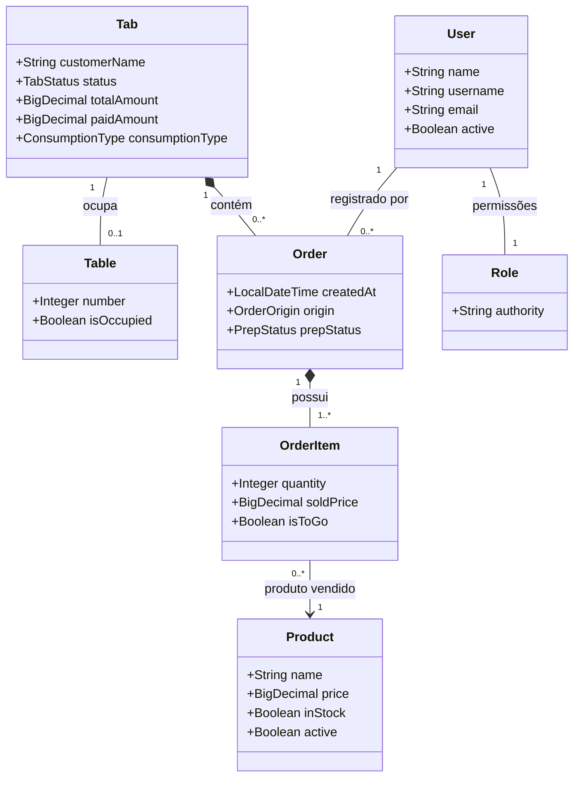

# Syskewer API - Gestão Inteligente para Bares e Restaurantes

Bem-vindo ao repositório backend do **Syskewer**. Este é o núcleo do nosso ecossistema de gestão para estabelecimentos gastronômicos. O sistema foi desenhado aplicando rigorosas **Regras de Negócio**, orquestrando operações complexas de forma simples, segura e escalável, automatizando desde a entrada do cliente até o fechamento do caixa.

Projeto desenvolvido em **Java 21** e **Spring Boot 3**, utilizando banco de dados **PostgreSQL**.

---

## 🎯 Destaques e Regras de Negócio Aplicadas

Este projeto vai muito além de um "CRUD simples" exigido academicamente. Ele implementa o fluxo real e caótico de um restaurante, protegendo a integridade dos dados através das seguintes regras:

* **Gestão de Salão e Mesas:** O motor de comandas impede a abertura de novas contas em mesas que já constam como ocupadas. A mesa só é liberada quando o saldo devedor chega a zero, e o pagamento trava se o valor informado for maior que a dívida.
* **Congelamento Anti-Inflação (Regra de Ouro):** No momento em que um pedido é lançado no Salão, o preço atual do produto é copiado e "congelado" no item do pedido (`soldPrice`). Se o preço for atualizado no cardápio amanhã, o histórico e a conta do cliente de hoje não sofrem mutação.
* **Validação de Estoque (Cozinha):** O sistema bloqueia instantaneamente tentativas de vender produtos inativos ou que estejam fora de estoque, garantindo que a cozinha não receba pedidos impossíveis de preparar.
* **Gestão de Fiado:** Clientes fiéis podem ter suas comandas arquivadas como pendentes (`IN_DEBT`). A mesa é liberada no salão, mas a dívida fica atrelada ao documento do cliente para cobrança futura.
* **Tratamento de Exceções Avançado:** A API é blindada por um `GlobalExceptionHandler`, interceptando falhas internas e convertendo-as em respostas HTTP corretas e amigáveis (`400 Bad Request` via `BusinessRuleException` ou `404 Not Found` via `ResourceNotFoundException`).

---

## 🏗️ Modelagem de Dados (Diagrama Físico)

O diagrama abaixo reflete a estrutura de domínio da aplicação e os relacionamentos gerenciados e gerados automaticamente via **JPA/Hibernate**:



---

## 📁 Arquitetura e Estrutura de Pastas

Para manter o projeto escalável, a estrutura de pacotes foi dividida de forma modular, respeitando as responsabilidades de cada camada:

```text
src/main/java/com/syskewer/api/
  ├── config/        # Filtros de Segurança, CORS e Inicialização de Dados
  ├── exception/     # Interceptadores e manipuladores de erro globais
  ├── model/         # Entidades JPA (Mapeamento relacional com o banco)
  ├── repository/    # Interfaces Spring Data JPA
  ├── service/       # Camada de regras de negócio (Cérebro da aplicação)
  ├── controller/    # Endpoints REST (Portas de entrada da API)
  └── dto/           # Objetos de Transferência de Dados (Com validações @Valid)
```

---

## 🚀 Como Configurar e Executar

### Pré-requisitos
* **Java 21**
* **PostgreSQL** (Versão 14 ou superior)

### Passo 1: Preparar o Banco de Dados
Abra o seu cliente do PostgreSQL (pgAdmin, DBeaver, psql) e crie um banco de dados em branco:
```sql
CREATE DATABASE syskewer_db;
```

### Passo 2: Configurar Variáveis de Ambiente
Por questões de boas práticas e segurança, o arquivo `application.properties` real é ignorado pelo Git (`.gitignore`).
1. Navegue até a pasta `src/main/resources/`.
2. Faça uma cópia do arquivo `application.properties.example` e renomeie-a para `application.properties`.
3. Preencha as propriedades `spring.datasource.username` e `spring.datasource.password` com os dados do seu banco de dados local.

*Nota Técnica:* O projeto utiliza o parâmetro `spring.jpa.hibernate.ddl-auto=update`. O próprio framework se encarregará de ler as classes Java e **gerar todas as tabelas e constraints automaticamente** no banco de dados na primeira execução, isentando a necessidade de scripts SQL manuais.

### Passo 3: Inicializar a Aplicação
Abra o terminal na raiz do projeto e execute:

**No Linux ou macOS:**
```bash
./mvnw spring-boot:run
```
**No Windows:**
```cmd
mvnw.cmd spring-boot:run
```

A API estará disponível e escutando na porta **8080**.

---

## 🛡️ Segurança e Inicialização Padrão
A aplicação é protegida por um filtro JWT e Spring Security. Na primeira vez em que for executada (com o banco de dados recém-criado), um `DataInitializer` entrará em ação para criar automaticamente os perfis (`Role`) e um **Usuário Administrador Mestre**. 

Isso garante que você possa iniciar os testes e avaliações via Postman/Insomnia imediatamente, sem precisar injetar dados manuais no banco.